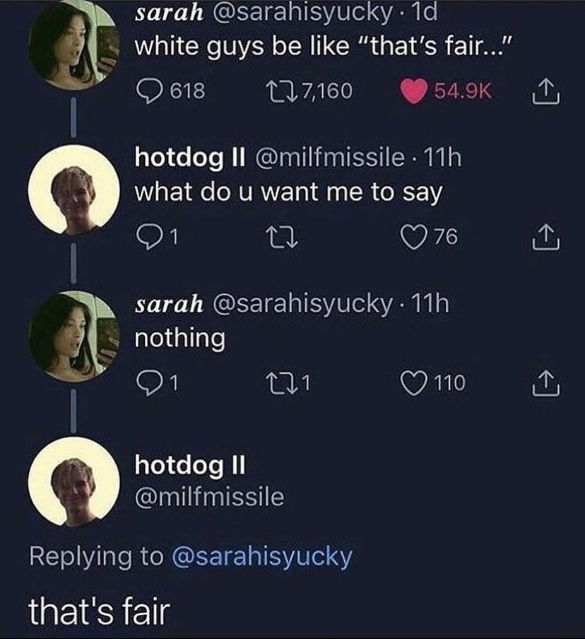

# Dad -- A Red DiscordBot Cog
This is meant to be a custom cog to be added to a [Red DiscordBot](https://github.com/Cog-Creators/Red-DiscordBot).

## Supported Jokes
+ I'm hungry -> Hello "hungry", I'm Dad!
+ Being a programmer is hard -> programmer, I barely know her!
+ In general Dad's jokes are amazing -> General Dad + a gif of a person saluting
+ Dad's jokes are a smashing good time -> A gif of Nigel Thornberries face plastered on someone elses body
+ One does not simply push one past Dad -> A gif from LOTR will serve as a simple reminder
+ Becky, please lemma smash -> A link to [Becky let me sMash](https://www.youtube.com/watch?v=qSJ5I5v8zwQ)
+ Okay boomer -> ok zoomer spelled out in emojis as a reaction to this message
+ Dad will request his children complete chores via reacting with the correct emojis.
+ Dad will pick favorite and least favorite based on user behavior to his messages and chores. He'll show this to everyone by giving stars to his favorite, and rude emojis to his least favorite.
+ Dad will randomly make someone "the fair child", in which he will respond a set number of times to their messages with "that's fair". Inspired by 

+ Dad will warmly greet new members to the server if they are real people, and coldly greet new members if they are a bot
  + Note, that he will send the greeting to the "system channel" of the server and will thus require permissions to send a message in said channel for this function to work.

## Adding a New Joke
+ New jokes can usually be added as a new sub-class of the Joke class in the jokes directory.
+ The easiest way to sublcass the Joke object is to look at the existing jokes, but take care to
 1. Change the `super().__init__("new_joke_name", joke_chance)` to the name of the joke and the default chance of occurrence [0.0,100.0]
 2. Implement the joke within the `_make_joke` method.
 3. Edit `jokes/__init__.py` to import your joke and add an instance of it to the `JOKES` dictionary
  - The proper key for the new instance is "JokeNameJoke"
 4. Add a short description of this joke to this README.

### Why This Structure?
The purpose is to have a standardized method of turning a user's message into a joke. 
Dad does this by randomizing the list of jokes, and then iterating through each joke until either he can make a joke with the message or he runs out of jokes.
This can be seen in ``on_message`` method in `dad.py`.
Further the `Joke` class adds the to the list of options that can be set for each guild.
This allows guilds to modify the probability that a particular joke will occur, without extra code needing to be written for that.
